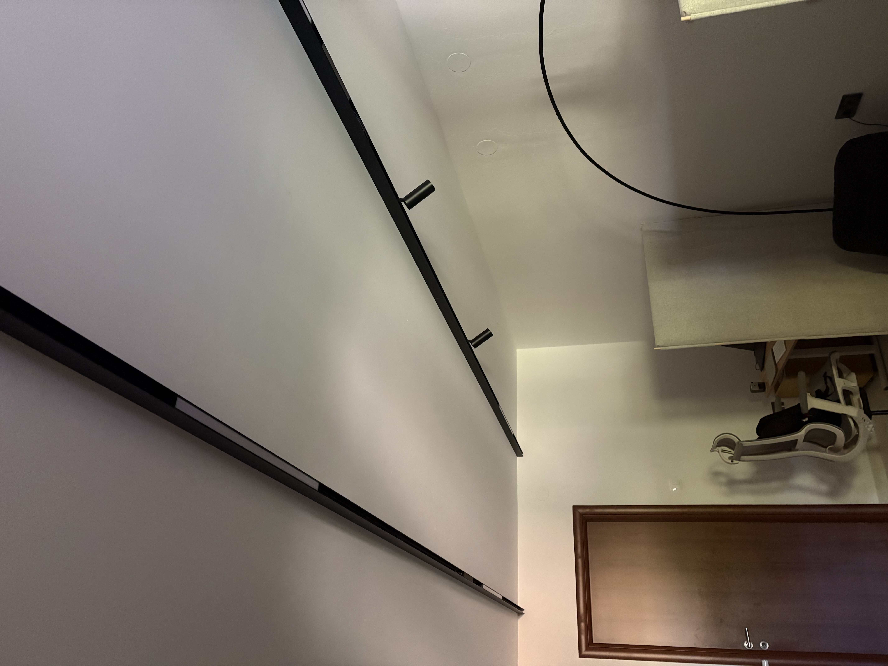
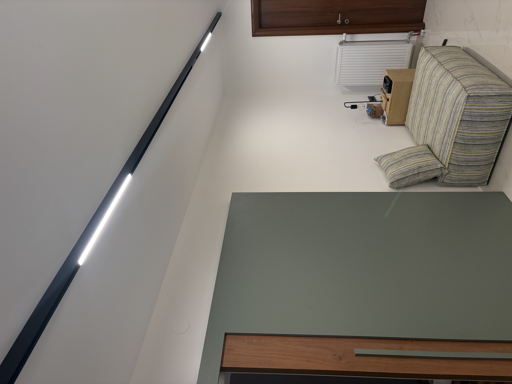
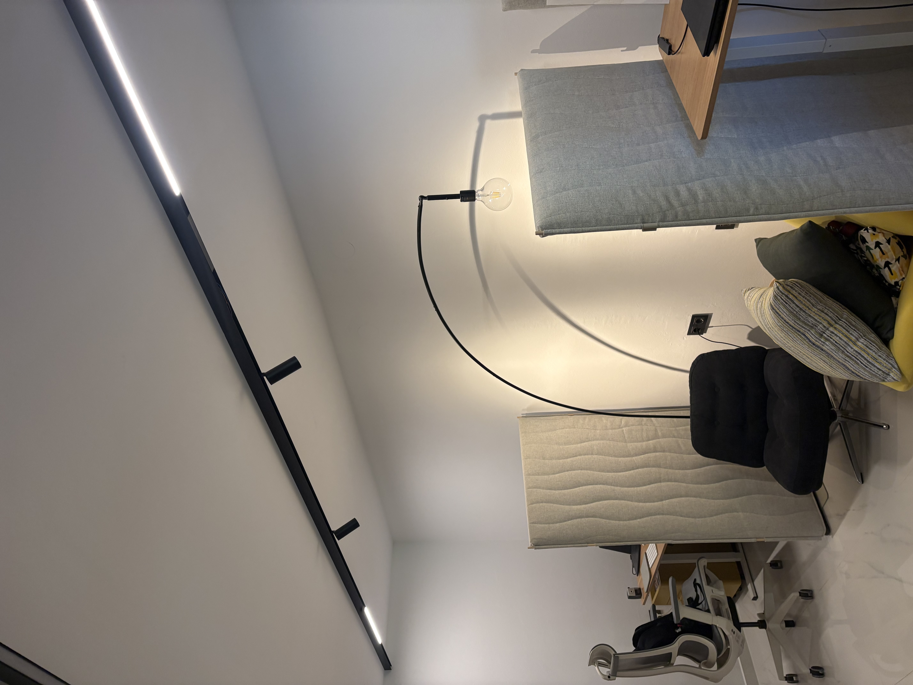

# AquaticMonkeys — Lighting Project
## Current installation and lighting layout

**Room:** approximately **6 m × 3 m = 18 m²**

**Current status:** the two magnetic tracks are already installed. This document records the current configuration and the lighting logic discussed so far. It is intended to be the baseline for any future additions or changes.

---

## 1. Room layout

The correct room orientation is:

- Long dimension: **6 m**
- Short dimension: **3 m**
- The **window is on the 3 m wall**
- The desks and phone booths are arranged along the opposite **6 m wall**
- There are **2 desks**
- There are **2 phone booths**

### Top view

```text
                         6 m
        DESK / BOOTH WALL — 6 m
┌───────────────────────────────────────────────────────┐
│ DESK         │  BOOTH 1   │  BOOTH 2   │    DESK      │
│                                                       │
│                                                       │
│                                                       │
│ ═══ Linear 60cm ═══   ●   ═══   ●   ═══ Linear 60cm │
│                                                       │
│                       RELSA #2                        │
│              2 × 60 cm Linear = 3370 lm              │
│                   2 × Spot = 1980 lm                  │
│                                                       │
│                                                       │
│ ═══ Linear 60cm ═══       ═══ Linear 60cm ═══       │
│                       RELSA #1                        │
│              2 × 60 cm Linear = 3370 lm              │
│                                                       │
│                                                       │
└───────────────────────────────────────────────────────┘
                         3 m
                       WINDOW
```

> **Note:** The drawing is schematic and not to scale. It represents the current installation concept and relative placement.

---

## 2. Existing magnetic-track installation

There are **two surface-mounted magnetic tracks**, running parallel to each other along the **6 m direction** of the room.

This is a good solution for the project because:

- the tracks are surface mounted;
- there is no need for recessed ceiling fixtures;
- the acoustic ceiling is not penetrated by multiple downlight cut-outs;
- linear and spot modules can be repositioned later;
- the system can be adjusted as the furniture/layout evolves.

### Track #1

Current modules:

- **2 × 60 cm linear LED modules**
- Total output: **3370 lm**

Track #1 is the simpler/general-lighting track.

### Track #2

Current modules:

- **2 × 60 cm linear LED modules**
- Total linear output: **3370 lm**
- **2 × spot modules**
- Total spot output: **1980 lm**
- Spots are directed toward the two phone booths.

### Current lighting output

| Component | Quantity | Total output |
|---|---:|---:|
| 60 cm linear LED | 4 | **6740 lm** |
| Spot LED | 2 | **1980 lm** |
| **Total installed light** | **6 modules** | **8720 lm** |

The above is the nominal fixture output. Actual illuminance at the desk/working plane will depend on mounting height, beam distribution, room reflectance, furniture, booth partitions and fixture efficiency.

---

## 3. Current lighting distribution

The **desk + booth zone is currently brighter** than the opposite/open part of the room.

This is expected because Track #2 has the additional **2 × 990 lm spotlights** aimed toward the booths.

The current distribution can therefore be represented as:

```text
                DESK / BOOTH WALL
┌──────────────────────────────────────────────┐
│                                              │
│   DESK      BOOTH 1     BOOTH 2      DESK   │
│                                              │
│       Linear        ● ●        Linear       │
│                  3370 + 1980 lm              │
│                                              │
│                                              │
│       Linear                    Linear       │
│                  3370 lm                     │
│                                              │
└──────────────────────────────────────────────┘
                         WINDOW
```

### Important observation

The room does **not** currently need additional light simply because the nominal lumen count is 8720 lm.

The next decision should be based on **where the light is needed**, rather than adding more total lumens indiscriminately.

---

## 4. Existing installation — photographs

### Photo 1 — magnetic tracks and booth area



### Photo 2 — linear modules on the magnetic track



### Photo 3 — tracks, linear modules and spotlights



---

## 5. Lighting philosophy

The current design intentionally avoids recessed ceiling downlights.

### Reasons

1. **Acoustic ceiling**
   - Avoid unnecessary penetrations through the acoustic ceiling construction.
   - Surface-mounted magnetic tracks preserve the ceiling treatment.

2. **Flexibility**
   - Magnetic modules can be moved along the track.
   - Additional linear or spot modules can be introduced later if required.

3. **Different lighting zones**
   - Linear modules provide the general illumination.
   - Spotlights provide focused illumination toward the phone booths.

4. **Coworking use**
   - The goal is comfortable, relatively uniform general lighting rather than a very high lumen output concentrated in one area.

---

## 6. Current booth lighting

The two existing spots on Track #2 are aimed toward the phone booths.

Their purpose is primarily to prevent the booth area from becoming visually dark and to provide focused illumination.

For future refinement, the booth lighting can be supplemented with a **vertical LED bar** if better face lighting for video calls is required.

Preferred characteristics:

- approximately 60–90 cm;
- 4000K;
- CRI ≥ 90;
- diffused rather than a harsh exposed point source;
- surface mounted or integrated into the booth structure;
- no penetration of the acoustic ceiling.

---

## 7. Desk lighting

The desks can receive additional local task lighting independently from the ceiling system.

Preferred solution:

**1 × under-shelf LED bar per desk**

Suggested characteristics:

- 4000K;
- CRI ≥ 90;
- approximately 800–1200 lm per desk;
- diffused profile;
- mounted underneath the shelf above the desk.

The purpose is to provide good illumination directly on the work surface without increasing the brightness of the whole room.

---

## 8. Target illumination

For this 18 m² coworking room, a useful design target is:

| Area | Target |
|---|---:|
| General room | ~300–400 lux |
| Desk work surface | ~500 lux |
| Phone booth | ~300–500 lux |

Remember:

**1 lux = 1 lumen/m²**

The installed **8720 lm** should not be interpreted as 8720 lm actually reaching the floor or desk surfaces. Fixture optics and room geometry determine the resulting lux distribution.

For final verification, the best method is to measure the actual lux at:

- each desk surface;
- each booth table;
- the central circulation area;
- the darker end of the room.

---

## 9. Current project — baseline

### Installed

- [x] 2 × parallel surface-mounted magnetic tracks
- [x] 4 × 60 cm linear LED modules
- [x] 2 × spot modules aimed at booths
- [x] No recessed ceiling downlights

### Current nominal output

**8720 lm total**

### Not yet required

- [ ] Additional ceiling fixtures
- [ ] Additional recessed lights

### Possible future refinement

- [ ] Under-shelf task lighting at each desk
- [ ] Vertical LED lighting inside each booth
- [ ] Repositioning of magnetic modules if lux measurements show uneven illumination

---

## 10. Recommended next step

Before buying additional ceiling modules, measure the actual illumination.

A simple lux-meter test should record approximately:

```text
Desk 1:       ____ lux
Desk 2:       ____ lux

Booth 1:      ____ lux
Booth 2:      ____ lux

Open area:    ____ lux
Dark end:     ____ lux
```

If the desk surfaces are already around **500 lux**, additional ceiling light should not be added there.

If the open/darker area is significantly below the target, the magnetic-track system gives us the flexibility to move or add a linear module specifically to that zone.

---

## Project principle

> **Do not chase lumens. Balance the light distribution.**

The existing magnetic-track installation gives us a flexible foundation. The next changes should be driven by measured lux and visual comfort rather than by simply increasing the total wattage/lumen count.
